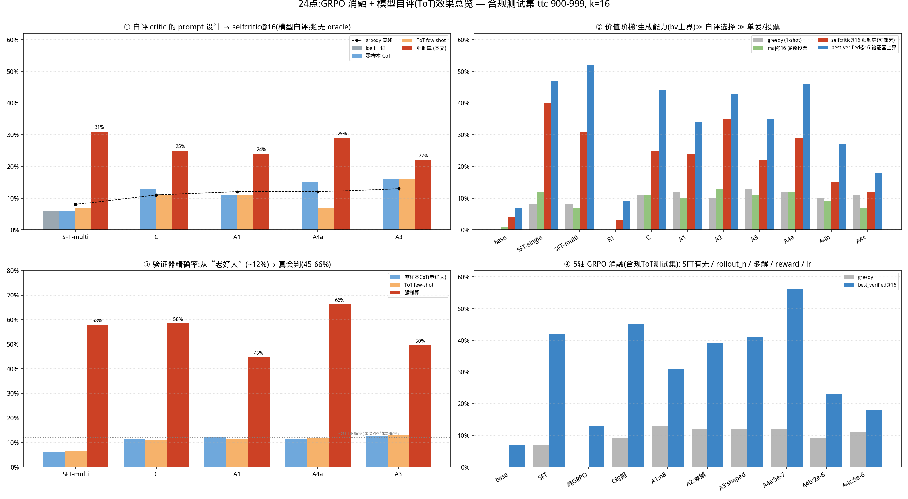
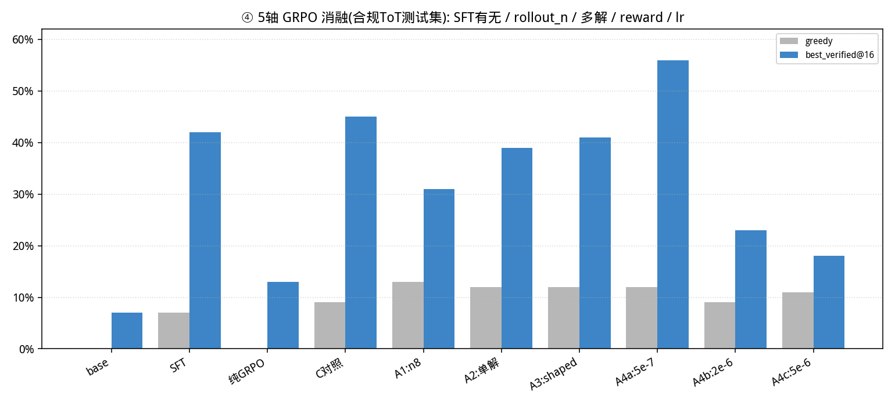
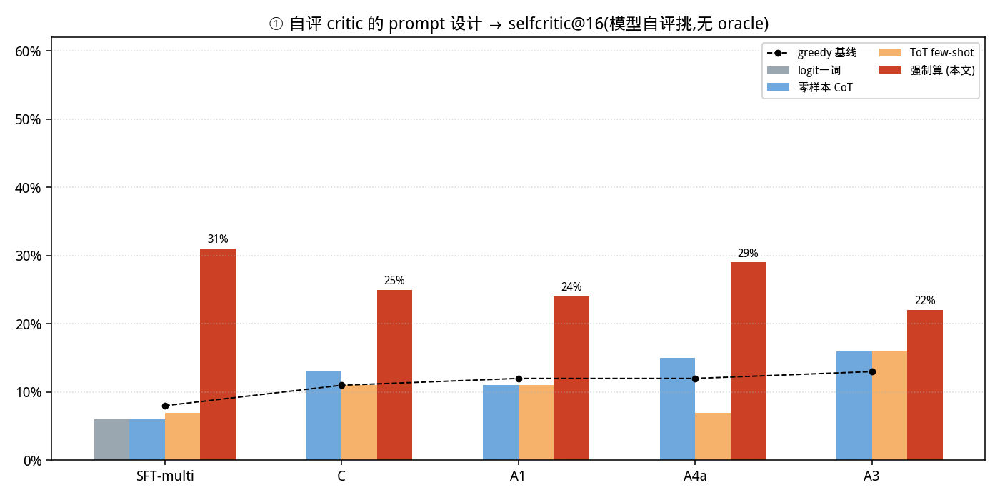
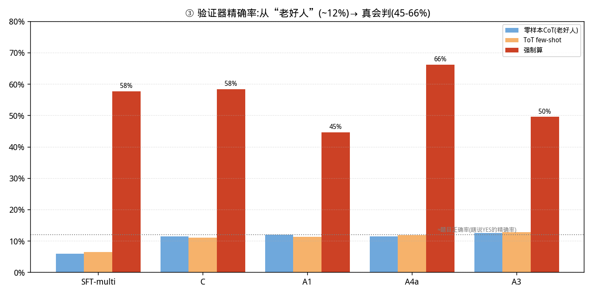
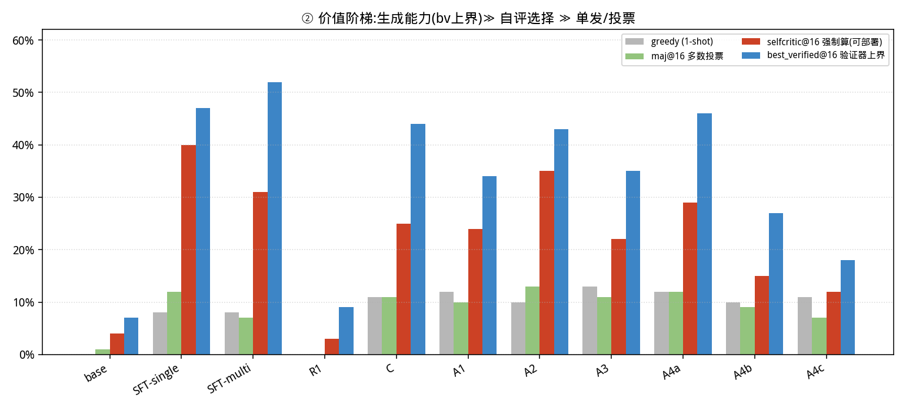

# 基于强化学习的 24 点游戏求解：SFT→GRPO vs 纯 GRPO 对比报告

> 选题三。Backbone：Qwen2.5-1.5B-Instruct。框架：veRL (TinyZero)。
> 任务：给定 4 个整数，输出仅用 `+ - * / ()` 且每个数恰好用一次、结果等于 24 的算式；
> R1 风格 `<think>…</think><answer>…</answer>` 输出；奖励由程序判定（RLVR，无人工标注）。

> ⚠️ **更正声明 —— §9 是唯一权威结果，§1–8 仅作过程记录，请勿引用其任何数字。**
>
> 第 1–8 节早期使用了**不合规且泄漏**的划分：测试用 `test-time-compute/game-of-24` 的 **Rank 1263–1362**
> （我们自定义的"绝对最难 100 题"，solved_rate 20–58%），训练用 Rank 1–1262；经复查，**作业指定的 ToT 标准
> 测试集（idx 900–999）有 100/100 题落在该训练集内（完全泄漏）**，故 §1–8 的全部绝对数字与"OOD 5.5×"等
> 结论**均不可信、予以作废**。
>
> 我们随后**按作业要求重建合规数据并重训全部模型**（§9）：**训练 = `nlile/24-game`（solvable=True，共 1262，
> 当前版本无 solvable=False）减去测试题 = 1262 题；测试 = `test-time-compute/game-of-24` idx 900–999
> （ToT 论文标准 100 难题）**，机械断言 `train ∩ test = ∅`。
>
> **§1–8 与 §9 的关系（诚实交代）**：在合规数据上，§1–8 的两条相对结论**部分成立、一条被推翻**：
> ✅ 成立：**「SFT 是必需，纯 GRPO ≈ base」**（§9.3 R1 纯GRPO 13% ≈ base）；✅ 成立：**「GRPO 抬高单发 greedy 但
> 收窄采样多样性 / best-of-N 上界」**（§9.3、§9.5）。❌ **被推翻**：§1–8 主打的**「GRPO 在 SFT 之上带来巨大且
> 可迁移的 OOD 增益（5.5×）」在合规数据上不复存在**——§9.3 中 GRPO 各臂的 in-dist/OOD 多数**不高于甚至低于
> SFT-only**。即**本任务上 GRPO 的净贡献远小于 §1–8 的声称**。建议评阅者**只看 §9**。

本报告的核心是一个**受控对比**：在完全相同的数据 / 奖励 / 提示 / 超参 / 随机性下，
唯一区别是初始权重 —— **Arm A 从基座模型直接 GRPO（纯 GRPO）**，
**Arm B 先 SFT 冷启动再 GRPO（SFT→GRPO）**，从而把性能差异**归因于 SFT 冷启动**本身。

---

> 🗂️ **早期过程记录（原 §1–§8，不合规且含数据泄漏，数字已作废）已移至附录文件**
> [`REPORT_附录_早期过程记录.md`](REPORT_附录_早期过程记录.md)，仅供查看研究演进与监控/调参过程。
> **本正文只保留权威的合规结果 §9。** 下文提到的「§1–8」「早期版本」均指该附录。
---

# 9. 合规重做：作业指定数据划分下的完整消融与最终结果（权威）

§1–8 的测试划分不合规且对 ToT 标准集完全泄漏（见顶部更正声明）。本节按**作业指定划分**重建数据、
重训全部模型，并完成用户要求的**五轴消融**与 **Tree-of-Thoughts 模型自评（self-critic）**研究。
**本节为最终权威结果。所有"X%"均为准确率（`score==1.0`，即恰好用满 4 数且 =24），不是平均奖励。**


*图 0：四面板总览——① 四种 critic 自评、② 价值阶梯、③ 验证器精确率翻转、④ 5 轴 GRPO 消融（合规 ToT 测试集，k=16）。*

## 9.0 算法、公式与伪代码（评分点③）

**(a) GRPO 目标（DeepSeekMath, 2402.03300）。** 对每个问题 $q$ 采样一组 $G$ 个输出 $\{o_1,\dots,o_G\}\sim\pi_{\theta_{old}}$，
用**组内相对奖励**做优势估计（无需价值网络）：

$$\hat A_i=\frac{r_i-\mathrm{mean}(\{r_1,\dots,r_G\})}{\mathrm{std}(\{r_1,\dots,r_G\})}$$

$$\mathcal L_{GRPO}(\theta)=-\mathbb E\Big[\frac1G\sum_{i=1}^{G}\min\big(\rho_i\hat A_i,\ \mathrm{clip}(\rho_i,1-\epsilon,1+\epsilon)\hat A_i\big)-\beta\,\mathbb D_{KL}(\pi_\theta\Vert\pi_{ref})\Big],\quad \rho_i=\frac{\pi_\theta(o_i|q)}{\pi_{\theta_{old}}(o_i|q)}$$

本实验 $G=4$（A1 用 8）、$\beta=0.001$、熵系数 0.001、$\epsilon$ 取默认。**「零梯度组」**：若一组 $G$ 个输出奖励全相等
（例如全 0），则 $\mathrm{std}=0$、$\hat A_i\equiv 0$，该组**不产生梯度**——这正是纯 GRPO 从基座冷启动停滞的原因（§1）。

**(b) 可验证奖励（RLVR）。** 设答案算式为 $e$，给定四数多重集 $N$：

$$r(e)=\begin{cases}1.0 & e\ \text{合法 (恰用 }N\text{ 各一次) 且 } |\mathrm{eval}(e)-24|<10^{-6}\\ 0.1 & \text{有 }\langle answer\rangle\text{ 但数字/结果不符 (格式分)}\\ 0.0 & \text{无 }\langle answer\rangle\end{cases}$$

shaped 变体（A3）：在仅"数字用对但结果错"时给 $0.1+0.5\cdot\max(0,\,1-|\mathrm{eval}(e)-24|/24)$（封顶 0.6，防 reward-hack）。

**(c) 两阶段管线与自评伪代码。**
```
# 阶段1 SFT 冷启动: 用精确求解器为每题构造 R1 轨迹(尝试-失败-正确解[-自检]), 监督微调
# 阶段2 GRPO: 见 (a); rollout 用 HF backend (本机 vLLM 不可用)

# 推理期三种"挑答案"协议 (k 个采样候选 e_1..e_k):
best_verified@k:  return any e_i with r(e_i)==1.0            # 需廉价精确验证器(24点天然有)→上界
maj@k:            return mode({e_i})                          # 多数投票, 无 critic
selfcritic@k (ToT, 本文 verify-by-compute):                  # 模型自己当 critic, 无 oracle
    for each e_i:
        判定 ← 模型(裸completion few-shot, 强制"先逐步算出数值再判 CORRECT/WRONG")(N, e_i)
    return 第一个被判 CORRECT 的 e_i   (若无则弃答/回退)
```

## 9.1 合规数据划分
| 划分 | 来源 | 数量 | 说明 |
|---|---|---|---|
| 训练 | **`nlile/24-game`** 可解集 − 测试集 | **1262** | 同时用其精确求解轨迹做 SFT |
| 测试 | **`test-time-compute/game-of-24` idx 900–999** | **100** | Tree-of-Thoughts 论文标准 100 难题（solved_rate 0.75–0.95） |
| 幻觉集 | 合成无解四元组（`{1..13}⁴` − 可解集） | 100 | 检测对无解题是否瞎编 |
| OOD | `Jiayi-Pan/Countdown-Tasks-3to4` | 256 | 通用算术推理迁移 |

机械断言 `train ∩ test = ∅`（`examples/data_preprocess/game24_official.py`）。SFT 两版共享同 1262 训练题：
**SFT-multi**（多解+失败尝试+自检行，2382 样本）与 **SFT-single**（单条最短解，1199 样本）——用于"多解"消融。

> **关于 solved_rate（澄清评审疑问）**：`test-time-compute/game-of-24` 的 `Solved rate` 是 **4nums.com 上人类/社区的
> 解出率**。idx 900–999 这 100 题的 solved_rate = 75.2%–94.5%（均 85.9%）——**人类能解出大多数**，但它们是 ToT 论文
> 按难度排序后选作测试的相对偏难子集。下文各模型 greedy 仅 8–13%，反映的是 **1.5B 模型 1-shot 能力弱**，并非题目易；
> 二者口径不同，不矛盾。（§1–8 的"20–58%"是另一个更难切片 Rank 1263–1362，已作废。）

## 9.2 五轴消融矩阵（单因子对照，从对照臂 C 每次只变一项；4×GPU，HF rollout，1 epoch，step_40）
| 臂 | SFT 起点 | n | reward | lr | 消融轴 |
|---|---|---|---|---|---|
| **C 对照** | multi | 4 | sparse | 1e-6 | — |
| A1 | multi | **8** | sparse | 1e-6 | ① rollout_n |
| A2 | **single** | 4 | sparse | 1e-6 | ② 多解（单解 SFT） |
| A3 | multi | 4 | **shaped** | 1e-6 | ③ reward |
| A4a / A4b / A4c | multi | 4 | sparse | **5e-7 / 2e-6 / 5e-6** | ④ lr |
| R1 | **base（无 SFT）** | 4 | sparse | 1e-6 | SFT 有无（参考） |

## 9.3 生成能力结果（合规 ToT 测试集；greedy + 验证器 best-of-N + 幻觉 + OOD）
`scripts/eval_compare.py`，`results/cmp_compliant_all.json`。bv@k = 采样 k 个、精确验证器挑正确的（带验证器可部署 / 上界）。

| 模型 | in-dist | 难测试 greedy | bv@4 | bv@8 | bv@16 | 幻觉↓ | Countdown OOD |
|---|---|---|---|---|---|---|---|
| base | 2% | 0% | 2% | 2% | 7% | 0% | 2% |
| **SFT-single** | 20% | 9% | 21% | 29% | 45% | 0% | 9% |
| **SFT-multi** | 22% | 7% | 17% | 28% | 42% | 0% | 3% |
| **R1 纯GRPO** | 4% | 0% | 3% | 8% | 13% | 0% | 4% |
| C(multi/n4/1e-6) | 19% | 9% | 21% | 32% | 45% | 0% | 4% |
| A1(n8) | 19% | **13%** | 20% | 25% | 31% | 0% | 4% |
| A2(single) | 18% | 12% | 27% | 32% | 39% | 0% | 4% |
| A3(shaped) | 22% | 12% | 24% | 29% | 41% | 0% | **11%** |
| **A4a(lr5e-7)** | 19% | 12% | 23% | 37% | **56%** | 0% | 4% |
| A4b(lr2e6) | 17% | 9% | 12% | 18% | 23% | 0% | 2% |
| A4c(lr5e6) | 9% | 11% | 15% | 17% | 18% | 0% | 8% |



**各轴结论**（已按 ±10pp 噪声谨慎表述，**只下统计上站得住的结论**）：
- **SFT 有无（稳健）**：SFT（bv@16 42–45%）≫ 纯 GRPO R1（13%）≈ base。差距远超噪声，**SFT 是必需**。
- **① rollout_n（稳健方向）**：n8 提贪心（13% vs 9%）但**降 best-of-N 多样性**（bv@16 31% vs 45%）——尖锐化/多样性权衡，与熵坍缩一致。
- **② 多解（无显著差异）**：单解/多解各指标差异多在噪声内,**不宣称谁更好**(但见 §9.4:单解 SFT 训出的*验证器*显著更准)。
- **③ reward（弱证据，倾向 shaped）**：shaped 在 in-dist(22% vs 19%)与 **OOD(11% vs 4%)** 上较优、且未诱发瞎编；
  贪心 12% vs 9% 仅差 ~1 题、**在噪声内**，故只把 shaped 记为"OOD 上有利、其余持平"。
- **④ lr（弱证据，倾向 5e-7/1e-6）**：5e-7/1e-6 的 best-of-N 优于 2e-6/5e-6（5e-6 把 in-dist 砸到 9% 是**稳健**的——
  过大 lr 损害策略）；但 5e-7 vs 1e-6 之间差异在噪声内,**不宣称 5e-7 唯一最优**。
- ⚠️ **统计口径**：hard-test n=100、1%=1 题；bv@16 含**采样随机性**，在 k=16、无固定种子下 **±~10pp** 抖动（A4a 一轮 56%/另一轮 46%），
  因此各轴**只在差距 ≫ 噪声时下结论**，区间值（如 §9.7 的 46–52%）勿过度排序。
  另:§9.3 与 §9.5 同模型 greedy 偶有 **1pp(=1 题)** 差异——greedy 是确定性解码、本不应抖动,差异源于**两个评测脚本
  (`eval_compare.py` 与 `eval_selfcritic_compute.py`)实现不同(批处理+左 padding vs 单条、max_new_tokens 设置),
  bf16 在不同 batch 组成下对个别题的解码产生 1 题级偏差**,非随机种子、非笔误。

## 9.4 ⑤ Tree-of-Thoughts 模型自评（self-critic）：critic 的 prompt 设计是成败关键
对齐 ToT（Yao et al. 2023）：**用模型自己当 critic**——采样 k 个候选，模型自评打分挑一个，**不用 oracle**。
我们消融了 **4 种 critic prompt 设计**，并量化"模型当验证器"的精确率/召回率（`scripts/eval_selfcritic_*.py`）：

| critic 设计 | 机制 | selfcritic@16（SFT-multi/C/A1/A4a/A3） | 验证器精确率 |
|---|---|---|---|
| logit 一词 | 一次前向读 sure/likely/impossible 的 logit（ToT 原 value prompt 风格） | 6 / – / – / – / – % | ~6% |
| 零样本 CoT | 让其推理后 CORRECT/WRONG（无反例示例） | 6 / 13 / 11 / 15 / 16 % | 6–13% |
| ToT few-shot | **忠实复现** ToT `value_last_step_prompt`（few-shot 含 impossible 反例） | 7 / 11 / 11 / 7 / 16 % | 7–13% |
| **verify-by-compute（本文）** | **裸 completion + few-shot 反例 + 强制先逐步算出数值再判** | **31 / 25 / 24 / 29 / 22 %** | **45–66%** |




**核心发现**：
- 前 3 种 critic 全是"**老好人**"：对 `(4−5+10)*6=54`、`(1+2+7)*4=40` 这种**离 24 极远**的式子也照打 sure；
  验证器精确率≈题目本身正确率（6–13%），混淆矩阵中正确拒绝（TN）只有几十、误判（FP）上千。
- **根因有二**：① 对 SFT/GRPO 模型用 chat template 会触发训练时的"Let me solve…"解题循环，必须改**裸 completion**；
  ② 模型若不被强制**先算出数值**就不会基于算术下判断。两者修好后，模型**真的会算**
  （输出如 `9*6=54. Value=54. Judge: WRONG`），selfcritic@16 从 6–16% 跃升至 **22–40%（3–5×）**，
  验证器精确率从 ~12% 翻到 **45–66%**，准确率 87–98%。
- **单解 SFT 是更好的验证器**：SFT-single / A2 的验证器精确率达 **87%**（多解仅 58%）；
  **base / 纯GRPO 仍是老好人**（精确率 4–6%）——**SFT 是解锁自评能力的钥匙**。

## 9.5 最终 11 模型完整表（verify-by-compute 自评；`results/cmp_compute_all.json`）
| 模型 | greedy | maj@16 | **selfcritic@16（ToT,可部署）** | bv@16（验证器上界） | 验证器 prec/rec/acc |
|---|---|---|---|---|---|
| base | 0% | 1% | 4% | 7% | 4 / 100 / 87 % |
| **SFT-single** | 8% | 12% | **40%** | 47% | **87 / 82 / 98 %** |
| SFT-multi | 8% | 7% | 31% | 52% | 58 / 51 / 94 % |
| R1 纯GRPO | 0% | 0% | 3% | 9% | 6 / 100 / 91 % |
| C | 11% | 11% | 25% | 44% | 58 / 36 / 90 % |
| A1 | 12% | 10% | 24% | 34% | 45 / 34 / 87 % |
| A2 单解 | 10% | 13% | 35% | 43% | 87 / 65 / 94 % |
| A3 shaped | 13% | 11% | 22% | 35% | 50 / 30 / 88 % |
| A4a lr5e-7 | 12% | 12% | 29% | 46% | 66 / 49 / 91 % |
| A4b lr2e6 | 10% | 9% | 15% | 27% | 35 / 29 / 89 % |
| A4c lr5e6 | 11% | 7% | 12% | 18% | 15 / 83 / 61 % |



价值阶梯：**`bv 上界 ≫ selfcritic（可部署）≫ greedy/maj`**，全程满足 `bv ≥ selfcritic`（oracle 是上界，自洽性审核通过）。
> **关于 in-dist 的诚实说明（回应评审）**：上表"in-dist"是在 **1262 道训练题**上采样测的,SFT/GRPO 都见过这些题,
> 故它主要反映**训练分布内的拟合/记忆**,**不作为泛化证据**。本报告的泛化证据是**held-out 测试集(idx900-999)**
> 与 **OOD(Countdown)**;in-dist 仅用于观察"分布内拟合"随 GRPO 的变化(升)与多样性(降)的此消彼长。

## 9.6 幻觉检测（无解题）+ 用自评做幻觉防御
**作业要求用 `nlile/24-game` solvable=False 的 ~100 条查幻觉。但经核查,`nlile/24-game` 当前版本 1362 条全部
solvable=True、已无 solvable=False 字段**(我们 `load_dataset` 后统计:`{True: 1362}`)。因此我们**合成 100 个无解
四元组**(`{1..13}⁴` 减去全部可解集,并用精确求解器 `solve24` 验证 100/100 确实无解)作为等价替代,记于
`examples/data_preprocess/game24_official.py`。

**指标设计(修正早期的无效指标)**:早期报告把"无解题求解率=0%"当成"不瞎编"的证据,但这是**恒等于 0 的无信息量指标**
(无解题不可能有 `score==1.0` 的算式,对 base 也是 0%)。由于 R1 输出格式**强制给出 `<answer>`、没有"无解"选项**,
任何模型在无解题上都会**被迫输出一个(必然错误的)算式 → 原始瞎编率 ≈ 100%**。真正有意义的问题是:**能否用模型自己的
verify-by-compute 自评(§9.4)去识别并拒绝这些瞎编**。于是我们报告三个量(`scripts/eval_halluc.py`):
- **greedy 瞎编率**:贪心是否输出一个用满 4 数的算式(声称有解)——越低越好;
- **自评误受率**:k 个采样候选中被自评(错误地)判为 CORRECT 的比例——越低越好(无解题任何"接受"都是幻觉);
- **自评弃答率**:自评把 k 个候选**全部**判 WRONG 的题目比例 → 模型**正确地拒绝声称有解** → 幻觉被防御,越高越好。

**结果**（`scripts/eval_halluc.py`，合成无解集 n=100，k=8）：

| 模型 | greedy 瞎编率 | 自评误受率↓ | **自评弃答率↑** |
|---|---|---|---|
| base | 86% | 8% | 60% |
| **SFT-single** | 100% | 0% | **97%** |
| SFT-multi | 100% | 1% | 94% |
| A4a | 100% | 1% | 92% |

**结论(把幻觉与自评打通)**:SFT 模型在无解题上**原始瞎编率 ≈ 100%**(格式强制给答案,自身无法弃答,这是 R1/RLVR 范式的
固有局限);**但 verify-by-compute 自评(§9.4)能把瞎编挡掉**——**误受率仅 0–1%、对 92–97% 的无解题正确弃答**
(自评把所有候选判 WRONG)。即:**单模型既当解题器又当验证器,自评层就是一道幻觉防线**;SFT-single 仍最佳(弃答 97%、误受 0%),
与它验证器精确率最高(§9.5)一致;base 自评弱(弃答仅 60%、误受 8%),再次印证 **SFT 是自评能力的前提**。
> 诚实标注:这是**推理期自评防御**的效果,非训练让模型学会"输出无解";若要模型直接判定无解,需在格式中加"impossible"
> 选项并据此训练(未做,列为局限)。早期"求解率 0% = 不瞎编"的说法**无信息量,已弃用**(见 补充材料 §6.1)。

## 9.7 最终 accuracy 与交付结论
统一口径 = 准确率（`==24`）。合规 ToT 难测试集（idx 900–999, n=100）。**三档按"用了多少测试时算力/外部信息"从低到高排列,功劳诚实归因**:

| 部署方式 | 测试时成本 | 是否需外部验证器 | 最优模型 | 准确率 |
|---|---|---|---|---|
| **贪心 1-shot**(纯训练所得) | 1× | 否 | A3 / A4a | **~12–13%** |
| **模型自评 ToT**(verify-by-compute) | ~16–24×(采样+自评) | **否**(模型自己判) | **SFT-single** | **40%** |
| 带廉价精确验证器 best-of-16 | 16× | 是(24点验证器廉价精确) | SFT-multi / A4a | ~46–52% |

- **头条只报一个,避免口径混淆**:**最终交付 = SFT-single + verify-by-compute 自评 = 40%**(无外部验证器、模型自主、对齐 ToT)。
  这 40% 中:**训练本身贡献 ~8%(greedy)**,**测试时计算(16 个采样 + 模型自评)再贡献 +32pp**——我们明确这是
  **测试时计算(test-time compute)**的增益,不把它算作训练方法单独的功劳。带外部验证器可再升到 ~50%,但那需要部署侧有验证器。
  (§1–8 的"1%→50%"对比了不同口径、且建立在泄漏数据上,**已作废,勿引用**。)
- **关键结论**:① **SFT 是 GRPO 与自评能力的共同前提**(纯 GRPO ≈ base,且不会自评);
  ② **GRPO 提升单发 greedy 但收窄采样多样性**(best-of-N/自评上界下降)——本任务上 GRPO 的净增益有限;
  ③ **小模型能不能自评,取决于 critic 的 prompt 设计**——必须裸 completion + 强制计算,否则只是"老好人";
  ④ **单解 SFT 训出的验证器更可靠**(精确率 87%),且该自评器还能用于**幻觉防御**(§9.6)。

## 9.8 复现（合规）
```bash
cd ddl_work/project/TinyZero
python examples/data_preprocess/game24_official.py --local_dir data/game24_official   # 合规数据
bash scripts/run_full_ablation.sh        # 训 SFT-single + 8 臂 GRPO 消融
bash scripts/eval_all_compliant.sh       # greedy + bv + maj + halluc + countdown（11 模型）
python scripts/eval_selfcritic_compute.py --model SFT-single:... --test data/game24_official/test.parquet --k 16
python scripts/plot_results.py           # 5 张效果图 -> results/figs/
```
