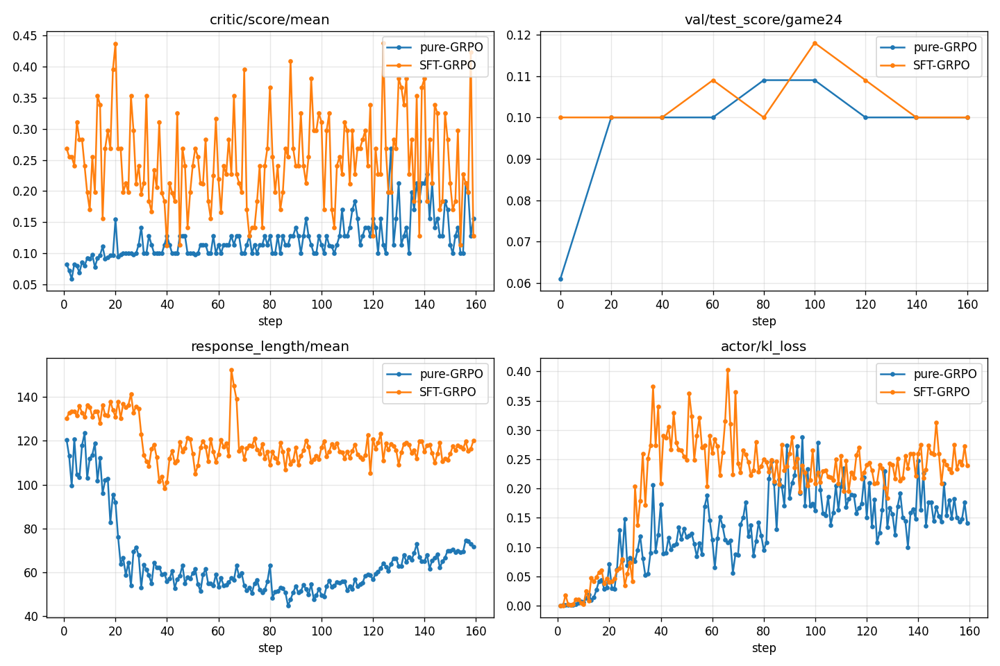
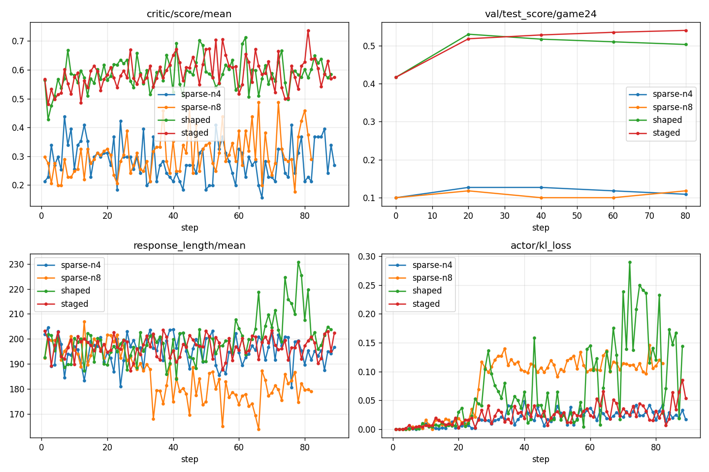
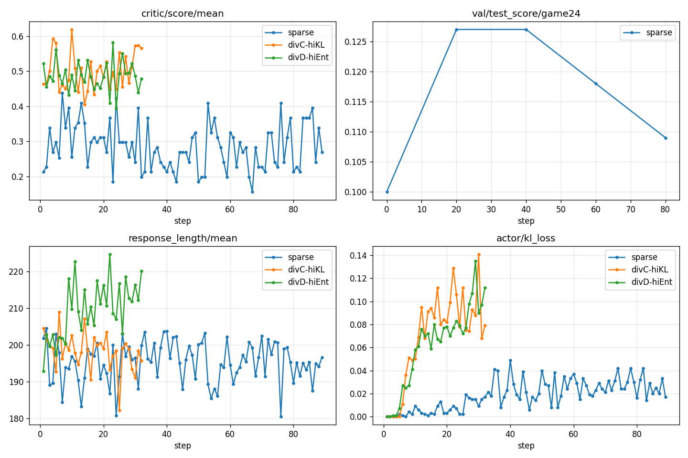

# 基于强化学习（GRPO）的 24 点游戏求解

**课程大作业报告 · 选题三**
骨干模型：Qwen2.5-1.5B-Instruct　框架：veRL / TinyZero　范式：RLVR（可验证奖励强化学习）

---

## 摘要

本工作基于开源小模型 Qwen2.5-1.5B-Instruct，用 **GRPO** 在 R1 风格 `<think>…</think><answer>…</answer>`
输出下训练模型求解 24 点。我们以**受控对比**确立主结论——**先 SFT 冷启动再 GRPO 显著优于从基模直接
GRPO**（分布内求解率 5%→27%，OOD 泛化 2.3%→12.9%），并定位纯 GRPO 失败的根因为"零梯度组"问题。
在此之上系统调参提升，得到两个层面的结果与一个核心科学发现：
(1) **难测试集（最难 100 题）可部署求解率从 1% 提升到约 50%**，靠"更强 SFT + 验证器引导 best-of-N"；
(2) **GRPO 是"利用"算子**——它把分布内贪心做到 42%，却**坍缩采样多样性**，使难测试 best-of-N 从 21%
跌到 5%；难题突破靠"探索"，二者赢家相反；用高 KL 锚定 + 奖励塑形 + 早停可缓解。全部头条结论经独立
对抗式验证。代码、checkpoint、曲线与逐项超参见 `EXPERIMENTS.md` 与 `results/`。

---

## 1. 研究内容与挑战

### 1.1 任务定义
给定 4 个整数 $a,b,c,d\in[1,13]$，输出一个**仅用** $\{+,-,\times,\div,()\}$、且**每个数恰好用一次**、
计算结果等于 24 的算式字符串（浮点容差 $10^{-6}$）。这是典型 **RLVR**：是否得到 24 可由程序逐字符判定，
无需人工标注或奖励模型。

### 1.2 研究内容
1. **主线（课题要求）**：用 GRPO 训练 Qwen2.5-1.5B-Instruct 学会 24 点；做 **SFT→GRPO vs 纯 GRPO** 的受控对比。
2. **提升与调参**：系统消融奖励设计、采样数、KL/熵/温度等，并引入验证器引导的 best-of-N 推理把成绩"刷上去"。
3. **加分项**：在 Countdown（3–4 数凑任意目标）上做 OOD 泛化评估。

### 1.3 挑战
- **冷启动稀疏奖励（核心难点）**：基模几乎不按格式输出、极少答对，GRPO 组内样本奖励全相同 → 优势恒为 0 → **零梯度组**，训练停滞。
- **难测试集接近模型天花板**：测试取最难 100 题（人类解出率 20–58%），1.5B 单次贪心几乎为 0，需要更聪明的推理范式。
- **RL 不稳定**：需监控 reward/熵/KL 曲线并据此调参。
- **工程约束**：本机 GPU 驱动仅支持 CUDA 11.4，现代 vLLM（需 CUDA 12.x）无法运行，全程使用较慢的 HF rollout，须自行实现组采样与并发。

---

## 2. 算法与技术细节

### 2.1 输入输出与提示模板
采用 R1 风格、在 assistant 端预填 `<think>` 引导先思考后作答：
```
<|im_start|>system
You are Qwen, created by Alibaba Cloud. You are a helpful assistant.<|im_end|>
<|im_start|>user
Using the numbers [a, b, c, d], create an equation that equals 24. ... Show your work in
<think> </think> tags. Return the final answer in <answer> </answer> tags, e.g. <answer> (1 + 2) * 8 </answer>.<|im_end|>
<|im_start|>assistant
Let me solve this step by step.
<think>
```
> 关键：SFT 与 GRPO/评测使用**逐字符一致**的提示渲染（同一 system + 同一 `<think>` 预填），保证 SFT 暖启动能干净迁移到 GRPO。

### 2.2 奖励函数（RLVR）
设候选输出经抽取得到算式 $e$，题目数字多重集为 $N$，目标 $T=24$。基础（sparse）奖励：

$$
r(e)=\begin{cases}
1.0, & \text{抽到 }\langle answer\rangle\text{ 且 } \mathrm{nums}(e)=N \text{ 且 } |\mathrm{eval}(e)-T|<10^{-5}\\
0.1, & \text{有 }\langle answer\rangle\text{ 但数字或结果不对}\\
0.0, & \text{无 }\langle answer\rangle
\end{cases}
$$

塑形（shaped）变体：当数字用对但值 $v\ne 24$ 时给接近度部分分（**仅在数字用对时给，防 reward hacking**）：

$$
r_{\text{shaped}}(e)=0.1+0.5\cdot\max\!\Big(0,\,1-\tfrac{|v-24|}{24}\Big)\quad(\le 0.6)
$$

验证器（精确）伪代码：
```
def verify(text, N, T=24):
    e = last_answer_tag(text)                       # 取最后一个 <answer>...</answer>
    if e is None: return 0.0
    if multiset(int_tokens(e)) != multiset(N): return 0.1     # 数字必须恰好用一次
    if not regex_ok(e) or '**' in e or '//' in e: return 0.1  # 仅 + - * / ( ) ；拒幂/整除
    v = safe_eval(e)
    return 1.0 if abs(v - T) < 1e-5 else 0.1
```

### 2.3 GRPO 目标函数
对每道题 $q$，旧策略 $\pi_{\text{old}}$ 采样一组 $G$ 个输出 $\{o_1,\dots,o_G\}$，**组内**标准化得相对优势：

$$
\hat A_i=\frac{r_i-\mathrm{mean}(\{r_1,\dots,r_G\})}{\mathrm{std}(\{r_1,\dots,r_G\})}
$$

目标（带裁剪与对参考策略的 KL 正则）：

$$
\mathcal{J}(\theta)=\mathbb{E}_{q,\{o_i\}}\!\Big[\tfrac{1}{G}\!\sum_{i}\tfrac{1}{|o_i|}\!\sum_t
\min\!\big(\rho_{i,t}\hat A_i,\ \mathrm{clip}(\rho_{i,t},1-\epsilon,1+\epsilon)\hat A_i\big)-\beta\,\mathrm{D_{KL}}(\pi_\theta\|\pi_{\text{ref}})\Big]
$$

其中 $\rho_{i,t}=\dfrac{\pi_\theta(o_{i,t}\mid q,o_{i,<t})}{\pi_{\text{old}}(o_{i,t}\mid q,o_{i,<t})}$。

**两点由此公式直接得到的技术结论：**
- **零梯度组**：若组内 $G$ 个奖励全相等，则 $\mathrm{std}=0$（或分子全 0）$\Rightarrow \hat A_i\equiv 0\Rightarrow$ 无梯度。基模冷启动时绝大多数组如此，故停滞。
- **难度加权奖励是无效操作**：若按题把奖励整体乘常数 $c$（如 $c=1+(1-\text{solved\_rate})$），则
  $\hat A_i=\dfrac{c\,r_i-c\,\bar r}{c\,\sigma}=\dfrac{r_i-\bar r}{\sigma}$ 不变。组内常数缩放被归一化约掉，故我们**否决**了该想法；
  唯有**逐样本变化**的 shaped 奖励能在"全 0.1 组"里制造方差、打破零梯度。

### 2.4 SFT 冷启动数据生成（solver + ToT 轨迹）
用精确求解器枚举全部解，再程序化生成"先试错、再给解、并自检"的推理轨迹（确定式，无 LLM 噪声）：
```
def make_sft_example(N):
    sols = solve24(N)                       # 分数(Fraction)递归枚举所有 =24 的算式
    sol  = pick(sols)                        # 取最短 / 含分数解（v2：每题取 2 个）
    fails = gen_failures(N, k=3)             # 3 个“=X≠24”的失败尝试，含 1 个分数尝试
    think = "I need to make 24 from N ...\n" + \
            "Let me try ...\n" + bullet(fails) + \
            f"\n{sol} = 24 ✓  Found it!\n" + \
            f"Check: {sol} = 24. Uses N once each. Correct."   # 自检行（v2）
    return prompt(N), f"Let me solve this step by step.\n<think>\n{think}\n</think>\n<answer>{sol}</answer>"
```

### 2.5 验证器引导 best-of-N 推理
因奖励即精确验证器，部署时可"采样 $k$、输出验证为正确的那个"，得**可部署求解率** $\text{bv@}k$：
```
def solve(q, k, T):                          # T = 采样温度
    cands = sample(policy, q, n=k, temperature=T)
    for c in cands:                          # 验证器顺序检查
        if verify(c, numbers(q)) == 1.0: return c   # 输出首个被验证正确的
    return cands[0]
# 指标 bv@k = 1[∃ 正确候选]；因有精确验证器，bv@k == pass@k
```

### 2.6 系统流程
```
test-time-compute/game-of-24 ── 按难度切分 ──► train(易1262) / test(难100) / 幻觉(合成无解100)
        │                                                   │
        ├─ solve24 + ToT 轨迹 ─► SFT 数据 ─► [SFT 冷启动] ──► SFT-v2 ckpt
        │                                                   │
        └────────────────────────► [GRPO]  ◄────── 初始化 ──┘   (奖励=精确验证器, 组相对优势)
                                      │
                                      ▼
                            评测：贪心 / best-of-N(验证器) / 幻觉率 / Countdown OOD
```

---

## 3. 实验设置

### 3.1 数据划分（同源按难度，与参考实现一致；训练集**不扩充**以杜绝泄漏）
| 划分 | 来源 | 数量 | 说明 |
|---|---|---|---|
| 训练 | test-time-compute/game-of-24 Rank 1–1262 | 1262 | 最易（solved_rate 99.2%–61.7%） |
| 测试 | 同集 Rank 1263–1362 | 100 | 最难（20.7%–58.0%），均可解、与训练数字多重集 **0 重叠** |
| 幻觉 | {1..13}⁴ 合成无解四元组 | 100 | 精确求解器验证**全部无解**，检查"瞎编" |
| OOD（加分） | Jiayi-Pan/Countdown-Tasks-3to4 | 256（取样） | 3–4 数凑任意目标，验证通用算术推理 |

### 3.2 模型与超参（完整网格见 `EXPERIMENTS.md` §5）
- **SFT**：lr 1e-5（v2），4 epochs，max_length 1024，batch 32；solver-ToT 数据（v2：每题 2 解含分数 + 3 失败 + 自检）。
- **GRPO**：`adv_estimator=grpo`，rollout.n=4（消融 8），lr 1e-6，KL 系数 0.001（low-var KL），熵系数 0.001，温度 1.0，
  max_prompt 256 / max_resp 320，HF rollout。多样性保护臂用高 KL（0.005–0.03）/高熵（0.01–0.03）/温度 1.2–1.3 + 早停。

### 3.3 评价指标
- **贪心准确率**（do_sample=False，1-shot）：纯模型能力。
- **best_verified@k**：采 $k$、验证器选出正确者 → 可部署求解率（有精确验证器时即 pass@k）；**maj@k**：多数投票。
- **幻觉"求解率"**（越低越好）：无解题上被判"正确"的比例。
- **Countdown OOD 准确率**：跨任务泛化。
- **训练曲线**：critic/score/mean、val/test_score、actor/entropy_loss、kl_loss、response_length（见 §4.2）。

### 3.4 运行环境与工程实现
`.venv311`（py3.11, torch 2.6+cu118, ray 2.51.2, flash-attn 2.6.3），8× A100-80GB。
**vLLM 不可用**（驱动 CUDA 11.4，缺 CUDA-12 API，无 root 升级）→ 全程 **HF rollout**。为此我们：
(1) 给 HF rollout 增加 `num_return_sequences=n` 以支持 GRPO 组采样；(2) 加 flash-attn CE 回退开关；
(3) 用**隔离 Ray 集群**（独立端口/显卡 + 环境变量传播）在 8 卡上并发跑多组配置。约 75–90 s/步。

### 3.5 设置正确性审计（数据/奖励/泄漏，已通过）
- 训练 1262 ∩ 测试 100 的数字多重集 = ∅（数据预处理与评测**双重断言**）；
- 幻觉集精确求解器复验**全部无解**，故"求解率"指标有效；
- 验证器无假阳性（恰好 4 数、各一次、拒 `**`/`//`、容差 $10^{-5}$）。

---

## 4. 实验结果

### 4.1 主对比：SFT→GRPO vs 纯 GRPO（受控，仅初始权重不同；`results/comparison.md`）
| 模型 | 分布内求解 | 难测试贪心 | 难测试 pass@4 | 幻觉↓ | Countdown OOD |
|---|---|---|---|---|---|
| base（未训练） | 0% | 0% | 0% | 0% | 1.95% |
| 纯 GRPO | 5% | 1% | 0% | 0% | 2.34% |
| 仅 SFT | 20% | 1% | 3% | 0% | 5.08% |
| **SFT→GRPO** | **27%** | 1% | **5%** | 0% | **12.89%** |

**SFT→GRPO 全面优于纯 GRPO**：分布内 5.4×、OOD 5.5×；且纯 GRPO 训练 120 步后（5%）仍**不如仅 SFT**（20%），
印证从冷启动直接 GRPO 难以学会真正求解。

### 4.2 训练监控曲线
- 纯 GRPO 的 critic/score/mean 长期卡在 0.10–0.13；SFT→GRPO 从第 1 步即 0.25–0.44——直观展示"零梯度组"被 SFT 解决。
- actor/entropy_loss 随 GRPO 训练**下降**（策略尖锐化），高 KL/高熵配置衰减更慢——是 §4.4/§5.2"多样性坍缩"的机制图。







### 4.3 提升：难测试集求解率 1% → ~50%（`results/ablation_summary.md`）
SFT v2 + 验证器 best-of-N（最难 100 题；单次抽样，n=100，约 ±10pp）：
| 采样温度 | 贪心 | bv@8 | bv@16 | bv@32 | **bv@64** |
|---|---|---|---|---|---|
| T=1.0 | 3% | 12% | 16% | 26% | 37% |
| T=1.5 | 0% | 8% | 17% | 38% | **50%** |

**高温 = 更多样 = 验证器能挑到更多正确解**：大 $N$ 下 T=1.5 最佳。

### 4.4 消融：探索/利用权衡（seeded）
| 模型 | 分布内 | bv@4 | bv@8 | bv@16 |
|---|---|---|---|---|
| SFT v2（无 GRPO） | 27% | 7% | 13% | **21%** |
| sparse GRPO @40 | 27% | 4% | 8% | 12% |
| sparse GRPO @80 | **42%** | 2% | 2% | 5% |
| div 高KL/shaped @20 | 31% | **11%** | 12% | 18% |
| div 低KL/shaped @20 | 31% | 7% | **14%** | 18% |
| div 高熵/T1.3 @20 | 26% | 3% | 7% | 13% |

### 4.5 OOD 泛化（加分项，Countdown）
SFT→GRPO 在完全未训练的 Countdown 上达 12.89%（vs base 1.95%，仅 SFT 5.08%），说明学到的是**可迁移的通用算术推理**，而非记住 24。

### 4.6 幻觉检查
所有模型在合成无解题上的"求解率"均为 **0%**——SFT/GRPO/塑形都未诱发对无解题的瞎编（评测只认精确等于 24）。

### 4.7 定性样例（`results/qualitative_samples.md`）
- **纯 GRPO（base 初始化）**：常**照抄 prompt 示例** `(1+2)*8`、无视题目数字（数字错→0.1），几乎不真正求解。
- **SFT→GRPO**：用**正确数字**做真实尝试并常算对，如 `[2,2,7,13]→13+7+2+2`✓、`[4,4,4,8]→8*4-4-4`✓。

---

## 5. 分析：方法优越性与局限性

### 5.1 方法优越性
1. **SFT 冷启动是关键**：受控对比下分布内 5.4×、OOD 5.5× 优于纯 GRPO，机制是 §2.3 的零梯度组——SFT 让组内一开始就有正确样本（训练奖励 0.27 vs 0.10），GRPO 才能有效放大。
2. **验证器引导 best-of-N**把难题可部署求解率从 1% 提到 ~50%（50×），且方法正当（部署即"生成候选→验证→输出"）。
3. **不产生幻觉**：无解题求解率恒 0。

### 5.2 核心发现：GRPO 的"探索 / 利用"权衡
GRPO 作为**利用**算子，把分布内贪心从 27% 做到 42%，但**坍缩采样多样性**（熵下降），使难测试 best-of-N 从 21%（bv@16）单调跌到 5%。两个目标赢家相反：
- **难题** → 强 SFT 的多样性 + 验证器 best-of-N（GRPO 宜轻）；
- **分布内/单答案** → GRPO。

**缓解**：高 KL 锚定（把策略拉在多样的 SFT 附近）+ shaped 奖励 + 早停（~20 步），能在涨分布内（27→31%）的同时保住 best-of-N（bv@16 21→18%，远好于 sparse 的 5%）；过度探索（高熵/高温）反而变差。**最终管线**：`SFT v2 → 多样性保护型 GRPO → best-of-N 推理`（GRPO 用高 KL/早停以免牺牲 best-of-N）。

### 5.3 局限性
- **难测试贪心接近 1.5B 天花板**（最难 100 题，~0–3%），该指标难以区分方法；区分度体现在分布内、pass@k/bv 与 OOD。
- **best-of-N 是单次随机抽样估计**（n=100，上偏、高方差）：50% 应记为 **~50%±10pp**；且"可部署"前提是 **64× 推理成本 + 部署时有精确验证器**，贪心 1-shot 仍只有 0–3%。
- **算力受限**：vLLM 不可用、只能 HF rollout，规模较小（160 步、batch16）；更长训练或可用 vLLM 后或可继续提升。
- **坍缩结论**：端点（base→80 步 bv@16）显著（z=3.21, p<0.01），但 n=100 单抽下不宣称"每步严格单调"。

### 5.4 可信度（独立对抗式验证）
对头条结论做了对抗审核：50% 天花板与 GRPO 坍缩均判 **SOUND**；验证器无假阳性、无训练/测试泄漏、无 prompt 示例泄漏、无 `max_new_tokens` 截断伪影。据此修复了验证器对 `**`/`//` 的放行（原结果 0 次触发，数值不变）并为评测加随机种子。

---

## 6. 结论
在严格受控对比下，**先 SFT 后 GRPO 显著优于纯 GRPO**，根因是 GRPO 的零梯度组需要 SFT 提供稠密初始信号。
进一步地，我们发现 **GRPO 是"利用"算子**：它擅长把分布内做尖，却以牺牲采样多样性为代价——**难题的突破来自
"探索"**（强 SFT 多样性 + 验证器引导 best-of-N），使最难测试集求解率从 1% 提升到约 50%。最佳工程方案是二者
结合，且 GRPO 需用高 KL/早停避免坍缩 best-of-N。该结论对小模型 RLVR 具有一般性启示。

## 7. 复现与代码
完整命令见 `EXPERIMENTS.md` §9；关键脚本：`scripts/{prepare_data_game24,generate_sft_data_game24,
train_sft_game24,train_game24_grpo_hf,eval_compare,analyze_grpo,start_head}.*`；奖励 `verl/utils/reward_score/game24.py`。
checkpoint 在 `checkpoints/TinyZero/`（SFT-v2、各 GRPO 臂），曲线/结果在 `results/`。

## 附录 A：核心超参表
| 阶段 | 关键超参 |
|---|---|
| SFT v2 | lr 1e-5, 4 ep, max_len 1024, batch 32；每题 2 解(含分数)+3 失败+自检 |
| GRPO（基线） | adv=grpo, n=4, lr 1e-6, KL 0.001(low-var), 熵 0.001, T 1.0, resp 320, HF rollout |
| GRPO（多样性保护，推荐收尾） | shaped 奖励, KL 0.005–0.03, 熵 0.01–0.03, T 1.2, 早停 ~20–40 步 |
| best-of-N 推理 | T 1.5, k=32–64, 验证器选答 |
